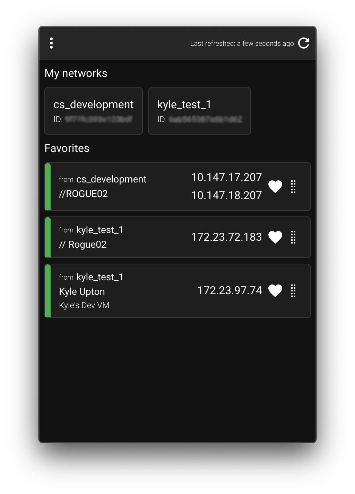
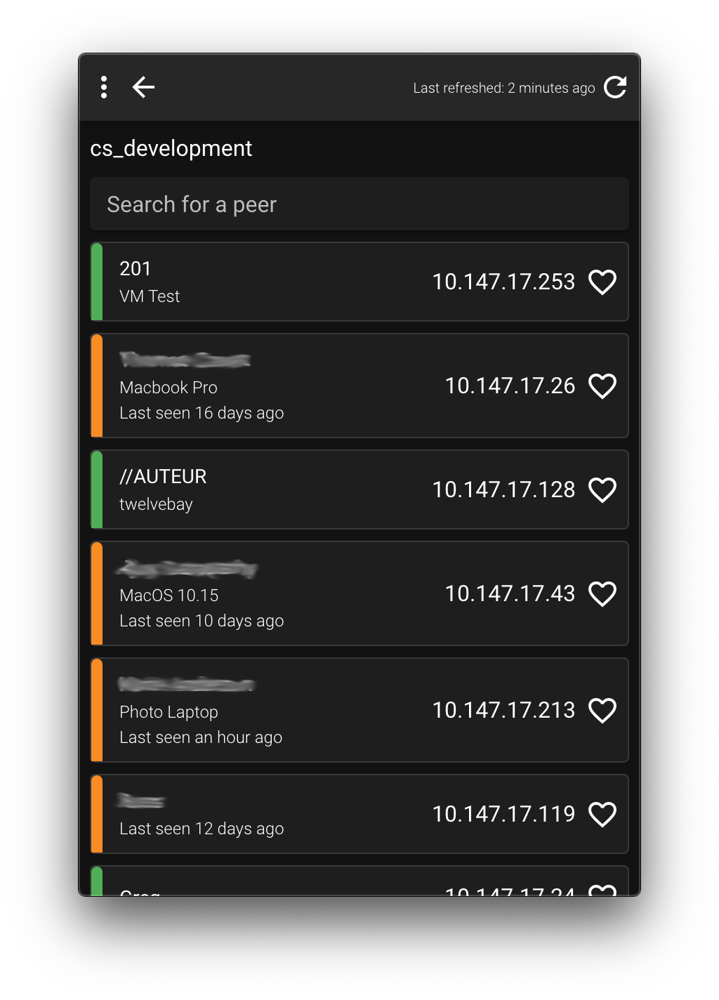
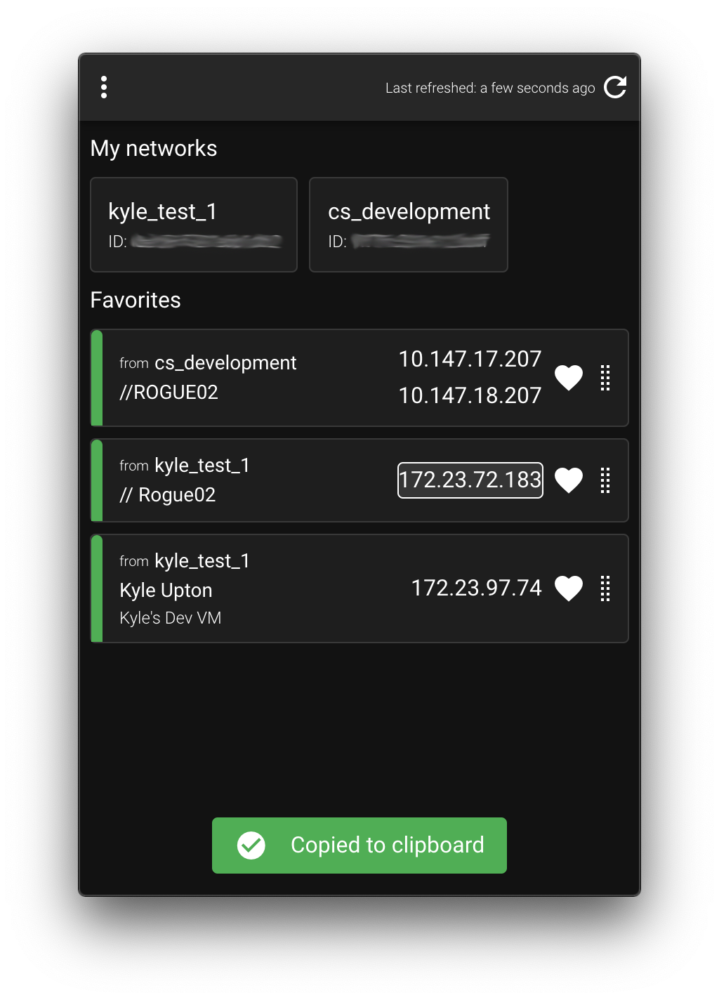

# ZeroTier Utility

ZeroTier Utility is a menu bar application that displays the ip address(s) of peers connected to your networks. ZeroTier Utility makes it easy to do devolopment work with remote computers/servers.

The only "gotcha" is the requirement of an authtoken for ZeroTier's central API. However, ZeroTier Utility can handle multiple authtokens from multiple accounts.

ZeroTier Utility does request admin privileges at startup to read the "authtoken.secret" file in ZeroTier One's working directory. This is to interact with ZeroTier One's local JSON API to get relevent data.

This is only the v1 release with minimal features, expect more releases in the future.

## Dashboard

## Network view

## Copying ip's

## Link to download

https://github.com/kyleaupton/zerotier-utility/releases/latest
